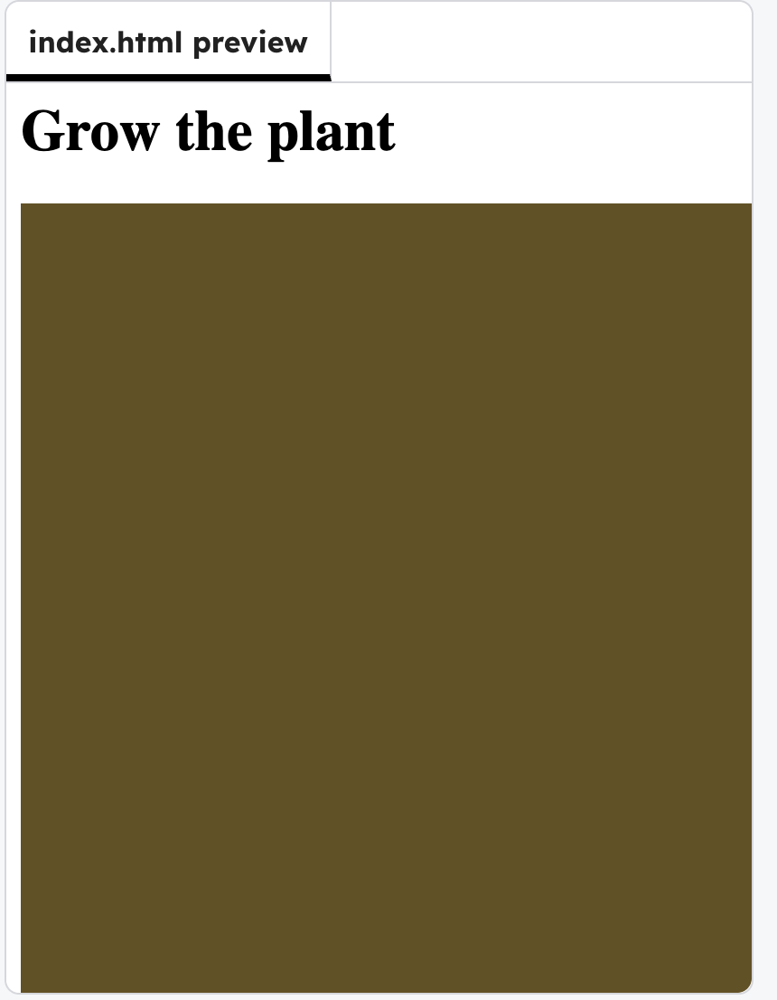

## Choose a cone
Add a background colour.

### Tip

The three numbers in `background(r, g, b)` are **r**ed, **g**reen, and **b**lue (**RGB**) values. All values need to be between 0 and 255.

--- code ---
---
language: javascript
filename: script.js
line_numbers: true
line_number_start: 16
line_highlights: 19
---
function draw() {
    background(100, 80, 30);
}
--- /code ---

### Now run your code 
The **Output window** should change colour. Expereiment with `RGB` values until you have the colour you want.

