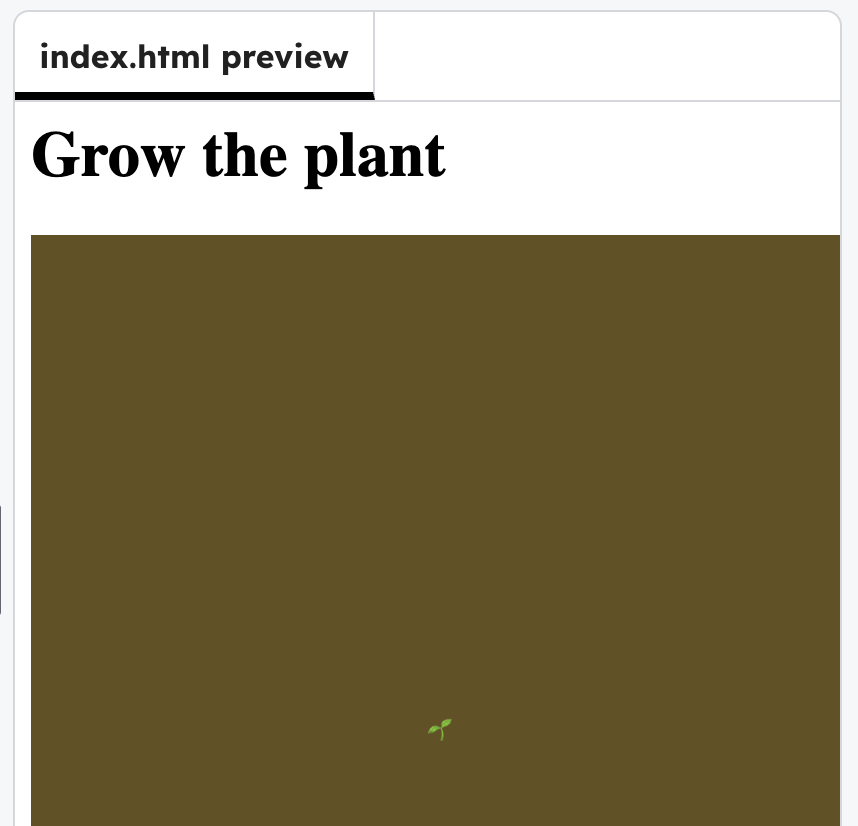

## Draw a thing

Use `text()` to draw an thing to grow. The code below uses a 🌱, but you can choose other emojis or text.

### Tip

`width / 2` is halfway across the canvas, and `height / 2` is halfway down, so this draws the thing in the middle.

--- code ---
---
language: javascript
filename: scripts.js
line_numbers: true
line_number_start: 7
line_highlights: 8
---
function draw() {
  background(100, 80, 30);
  text("🌱",  width/2, height/2);
}
--- /code ---

### Now run your code
You should see the emoji text appear in the middle of the **Preview window**.

