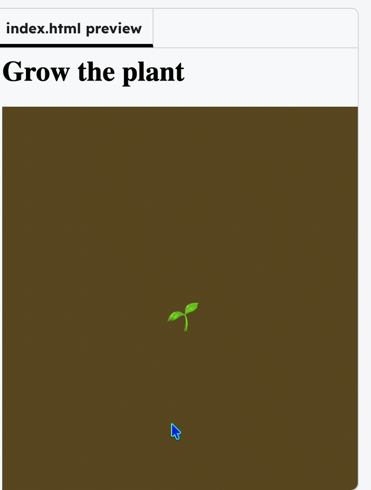

## Grow the plant
Use `mousePressed()` to change the size when clicked.

--- code ---
---
language: javascript
filename: scripts.js
line_numbers: true
line_number_start: 8
line_highlights: 14-16
---
function draw() {
  background(100, 80, 30);
  textSize(plantsize);
  text("🌱",  width/2, height/2);
}

function mousePressed() {
  plantsize += 4;
}
--- /code ---

### Tip

`plantsize += 4` adds `4` to the current `plantsize`.

### Now run your code
The emoji should get bigger. You have grown a thing! Try changing the number in `mousePressed()` to make it grow faster.

